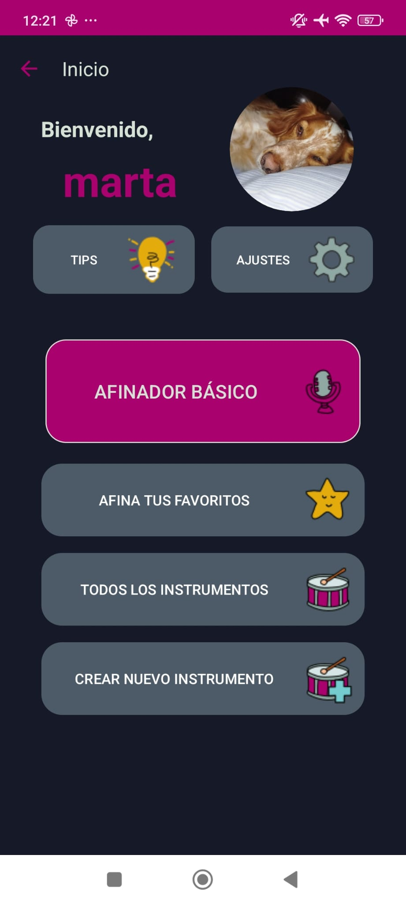
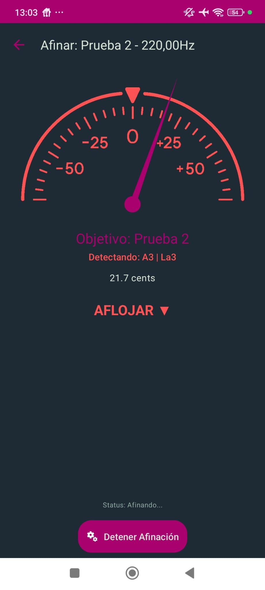
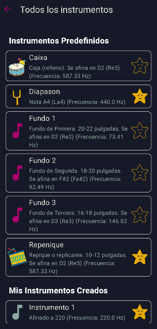

# BatukAfina 🥁

**Un afinador de percusión especializado y una herramienta educativa para Android, construido con Kotlin y un motor de procesamiento de audio avanzado.**

---

## 🎯 Sobre el Proyecto

BatukAfina nace de una necesidad real en la comunidad de músicos de percusión, especialmente en los ensambles de batucada: la falta de una herramienta de afinación precisa y fácil de usar para tambores. Los afinadores cromáticos estándar a menudo fallan al interpretar los complejos armónicos de la percusión, llevando a errores de octava y a una experiencia frustrante para el músico.

Esta aplicación aborda el problema desde dos frentes:

1.  **Herramienta de Precisión:** Ofrece un motor de análisis de audio robusto que identifica la frecuencia fundamental real, incluso en entornos ruidosos.
2.  **Plataforma Educativa:** Proporciona un entorno en desarrollo de guías y contexto para que los músicos sin formación teórica puedan entender el proceso de afinación y mejorar el sonido de su conjunto.

El proyecto fue desarrollado desde cero como proyecto final de DAM, abarcando todo el ciclo de vida del software, desde el análisis de requisitos y el diseño de la arquitectura hasta la implementación y las pruebas.

---

## 🗺️ Flujo de Navegación

El flujo de navegación de la aplicación ha sido diseñado para ser intuitivo y funcional, separando claramente la experiencia del usuario no registrado de la del usuario autenticado.

### Flujo de Entrada y Autenticación

* El punto de entrada es la **`MainActivity`**, que actúa como un enrutador. Al iniciarse, comprueba si existe una sesión de usuario activa.
  * **Si la sesión está activa**, el usuario es dirigido directamente a la **`UserHomeActivity`**, su panel principal.
  * **Si no hay sesión**, se le presentan tres opciones claras: "Iniciar Sesión" (que lleva a `LoginUserActivity`), "Registro" (que lleva a `CreateAccountActivity`), y "Usar Afinador Básico" (que ofrece acceso inmediato a `BasicTunerActivity` sin necesidad de una cuenta).
* Las pantallas de `Login` y `Registro` están interconectadas para facilitar el flujo, y ambas conducen a la `UserHomeActivity` tras una autenticación exitosa.

### Módulo Principal (Usuario Registrado)

La **`UserHomeActivity`** es el hub central para los usuarios registrados. Desde aquí, la navegación se ramifica hacia los módulos principales de la aplicación:

* **Gestión de Instrumentos:**
  * Se accede a `InstrumentsActivity` para ver la colección completa.
  * Desde esta pantalla, el usuario puede iniciar el proceso de creación (`CreateInstrumentActivity`) o, mediante un diálogo de opciones, modificar (`EditInstrumentActivity`) o afinar un instrumento.
* **Afinación:**
  * Se puede acceder al `BasicTunerActivity` como herramienta rápida (incluso sin haber iniciado sesión).
  * Se accede al `SpecificTunerActivity` de forma contextual desde las listas de instrumentos o favoritos para una afinación de precisión.
* **Contenido Educativo:**
  * El botón "Tips y Guías" lleva a `TipsActivity`, que sirve de portal para la guía de afinación y la tabla de frecuencias.
* **Gestión de Perfil:**
  * `SettingsActivity` centraliza todas las opciones de la cuenta, incluyendo el cierre de sesión, que devuelve al usuario al flujo de autenticación inicial.

---

## 📸 Capturas de Pantalla

|             Menú Principal              |             Afinador Específico             |                 Lista de Instrumentos                 |
|:---------------------------------------:|:-------------------------------------------:|:-----------------------------------------------------:|
|  |  |  |

---

## ✨ Características Principales

* **Sistema de Autenticación:** Registro, inicio de sesión y gestión de perfiles de usuario.
* **Afinador Básico Cromático:** Para una rápida identificación de cualquier nota musical.
* **Afinador Específico por Objetivo:** Guía al usuario con feedback visual (colores e instrucciones "Apretar/Aflojar") para alcanzar una frecuencia predeterminada.
* **Gestión de Instrumentos (CRUD):**
    * Un catálogo de instrumentos predefinidos.
    * Posibilidad de crear, modificar y eliminar instrumentos personalizados.
    * Sistema de "Favoritos" para un acceso rápido.
* **Módulo Educativo:** Incluye una guía visual paso a paso para afinar un tambor y una tabla de consulta de frecuencias.

---

## 🛠️ Stack Tecnológico y Arquitectura

La aplicación se ha construido siguiendo las mejores prácticas recomendadas por Google para el desarrollo nativo en Android.

* **Lenguaje:** **Kotlin 100%**, aprovechando sus características de seguridad y las **Corrutinas** para gestionar las operaciones en segundo plano.
* **Arquitectura:** **MVVM (Model-View-ViewModel)**, utilizando componentes de **Android Jetpack** como `ViewModel` y `LiveData` para crear una interfaz de usuario reactiva y desacoplada.
* **Base de Datos:** **SQLite** gestionada a través de una implementación manual de `SQLiteOpenHelper` y el **patrón DAO** (Data Access Object) para encapsular la lógica de acceso a datos.
* **Interfaz de Usuario (UI):** Diseñada con **XML Layouts** y la librería **Material Components (Material 3)** para una experiencia de usuario moderna y consistente.
* **Librerías Clave:**
    * **JTransforms:** Para la implementación de la **Transformada Rápida de Fourier (FFT)**, el núcleo matemático del análisis de espectro.
    * **Glide:** Para la carga y gestión eficiente de imágenes.
    * **JUnit 4 & Truth:** Para la realización de pruebas unitarias en la capa de datos.

### 🔬 El Motor de Afinación: Un Vistazo Técnico

El verdadero corazón de BatukAfina es su pipeline de procesamiento de audio, diseñado para ser robusto contra el ruido y los errores de octava:

1.  **Captura y Ventana:** El audio se captura en tiempo real y se le aplica una **Ventana de Hamming** para reducir la fuga espectral.
2.  **Análisis Espectral (FFT):** La señal se transforma al dominio de la frecuencia para obtener su espectro de energía.
3.  **Detección de Fundamental (HPS):** Se implementa el **Espectro de Producto Armónico** para discriminar los armónicos y aislar la frecuencia fundamental real, solucionando el principal problema de los afinadores genéricos.
4.  **Ponderación y Refinamiento:** Se aplica una **ponderación de frecuencia** para dar prioridad a los tonos graves y una **interpolación parabólica** para alcanzar una precisión sub-hertziana.

---

## 🚀 Vías Futuras

BatukAfina es un proyecto con un gran potencial de crecimiento. Algunas de las futuras mejoras planificadas incluyen:

* **Mejora del sistema de Autenticación** para proteger la privacidad de los usuarios.
* **Migración a Jetpack Compose** para modernizar completamente la capa de UI.
* **Implementación del patrón Repositorio** para centralizar aún más el acceso a los datos.
* **Investigación de algoritmos de afinación alternativos** como YIN para mejorar la precisión.
* **Aplicación de ponderación de frecuencias personalizadas** para mejorar la afinación en octavas altas.
* **Sincronización en la nube con Firebase** para permitir perfiles de usuario multiplataforma y la posibilidad de compartir afinaciones.
* **Nuevas herramientas para el músico**, como un metrónomo avanzado y una grabadora de ritmos.
* **Mejora del diseño de la interfaz de usuario** para una experiencia más fluida y accesible.